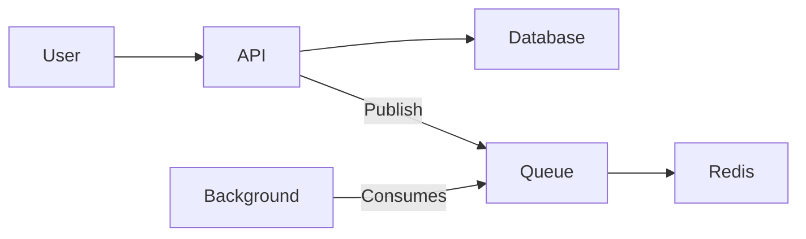

# Challenge-18

## Setup

### Requirements

- [Go 1.20>](https://go.dev/dl/)
- [Docker](https://www.docker.com/products/docker-desktop/)
- [Redis](https://redis.io/)
- [MySQL](https://www.mysql.com/)

### Running

Create a .env file inside configs folder.

> **NOTE:** You can copy and paste .EXAMPLE.env and rename it.

```sh
# .EXAMPLE.env
DATABASE_URL="mysql:mysql@tcp(127.0.0.1:3306)/database?parseTime=True"
PORT="4000"
ENABLE_STARTUP_MESSAGE=true
ENABLE_PRINT_ROUTES=false
ENABLE_STACK_TRACE=false
SKIP_MIGRATION=false
REDIS_URL="redis://:redis@127.0.0.1:6379"
EMAIL_SENDER="no-reply@company.com"
EMAIL_SENDER_NAME="Company (No Reply)"
# ENVIRONMENT="DEV"
# SENDGRID_API_KEY="SG.my-send-grid-key"
```

Then you could start the dev environment dependencies, with docker compose command:

```sh
docker compose up -d
```

After that you could start the API:

```sh
go run main.go api
```

And the background processor:

```sh
go run main.go background
```

## Arch



## Examples

Get Manager Token:

```h
POST /api/v1/auth/login
{
	"usernameOrEmail": "manager",
	"password": "manager"
}

# response
{
	"expiresAt": 1721506733,
	"refreshExpiresAt": "2024-07-20T18:13:53.9698551-03:00",
	"refreshToken": "<REFRESH-TOKEN",
	"token": "<JWT-TOKEN>"
}
```

Get Tech Token:

```h
POST /api/v1/auth/login
{
	"usernameOrEmail": "user1",
	"password": "user1"
}

# response
{
	"expiresAt": 1721506733,
	"refreshExpiresAt": "2024-07-20T18:13:53.9698551-03:00",
	"refreshToken": "<REFRESH-TOKEN",
	"token": "<JWT-TOKEN>"
}
```

Create a New Task:

```
POST /api/v1/tasks
Authorization: Bearer <(TECH) JWT-TOKEN>
{
	"summary": "my manual task"
}

# response
{
	"id": "a3238864-8e75-47e7-86ac-ec449dbecea1",
	"summary": "my manual task",
	"userId": "0a62c175-1512-43b5-abd4-8c5bf49f4a49",
	"performedAt": null,
	"createdAt": "2024-07-20T17:09:28-03:00",
	"updatedAt": "2024-07-20T17:09:28-03:00",
	"deletedAt": null
}
```

Get All Tasks (Manager):
```h
GET /api/v1/tasks
Authorization: Bearer <(Manager) JWT-TOKEN>

# Response
{
	"metadata": {
		"self": {
			"Limit": 100,
			"Offset": 0
		}
	},
	"total": 3,
	"items": [
		{
			"id": "2f436752-0e23-4eb1-9963-ee8e9d04e972",
			"summary": "Task User 2",
			"userId": "0a62c175-1512-43b5-abd4-8c5bf49f4a49",
			"performedAt": null,
			"createdAt": "2024-07-20T00:00:00Z",
			"updatedAt": "2024-07-20T00:00:00Z",
			"deletedAt": null
		},
		{
			"id": "30a97ed5-cee3-46d2-aebb-bf3f57417223",
			"summary": "Task User 1",
			"userId": "7aff9b64-d52a-485c-a738-fcae9e5cede0",
			"performedAt": null,
			"createdAt": "2024-07-20T00:00:00Z",
			"updatedAt": "2024-07-20T00:00:00Z",
			"deletedAt": null
		},
		{
			"id": "a3238864-8e75-47e7-86ac-ec449dbecea1",
			"summary": "my manual task",
			"userId": "0a62c175-1512-43b5-abd4-8c5bf49f4a49",
			"performedAt": null,
			"createdAt": "2024-07-20T20:09:29Z",
			"updatedAt": "2024-07-20T20:09:29Z",
			"deletedAt": null
		}
	]
}
```

Get All Tasks (Tech):
```h
GET /api/v1/tasks
Authorization: Bearer <(Tech) JWT-TOKEN>

# response
{
	"metadata": {
		"self": {
			"Limit": 100,
			"Offset": 0
		}
	},
	"total": 2,
	"items": [
		{
			"id": "2f436752-0e23-4eb1-9963-ee8e9d04e972",
			"summary": "Task User 2",
			"userId": "0a62c175-1512-43b5-abd4-8c5bf49f4a49",
			"performedAt": null,
			"createdAt": "2024-07-20T00:00:00Z",
			"updatedAt": "2024-07-20T00:00:00Z",
			"deletedAt": null
		},
		{
			"id": "a3238864-8e75-47e7-86ac-ec449dbecea1",
			"summary": "my manual task",
			"userId": "0a62c175-1512-43b5-abd4-8c5bf49f4a49",
			"performedAt": null,
			"createdAt": "2024-07-20T20:09:29Z",
			"updatedAt": "2024-07-20T20:09:29Z",
			"deletedAt": null
		}
	]
}
```

Finishes a task (Tech):
```h
PUT /api/v1/tasks/a3238864-8e75-47e7-86ac-ec449dbecea1
Authorization: Bearer <(Tech) JWT-TOKEN>

{
	"done": true
}

# Response:
{
	"id": "a3238864-8e75-47e7-86ac-ec449dbecea1",
	"summary": "my manual task",
	"userId": "0a62c175-1512-43b5-abd4-8c5bf49f4a49",
	"performedAt": "2024-07-20T17:09:50-03:00",
	"createdAt": "2024-07-20T17:09:28-03:00",
	"updatedAt": "2024-07-20T17:09:28-03:00",
	"deletedAt": null
}
```